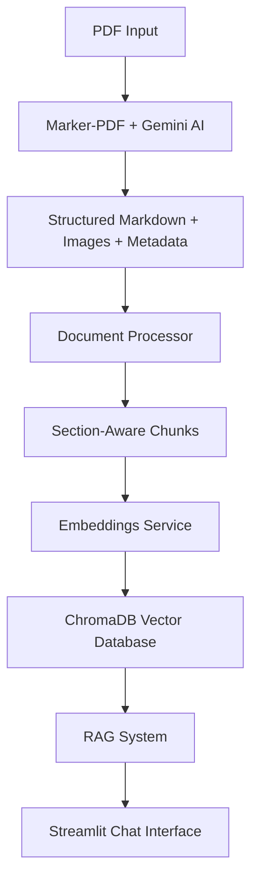

# MedMind

**AI-Powered Medical Education Assistant**

A comprehensive PDF-to-RAG (Retrieval-Augmented Generation) system designed specifically for physiology education. MedMind converts PDF documents to structured markdown, processes them into searchable chunks, and provides AI-powered question answering for medical students.

[](https://www.python.org/downloads/)
[](https://opensource.org/licenses/MIT)
[](https://github.com/psf/black)

## 🚀 Features

- **📄 PDF Processing**: Convert physiology PDFs to structured markdown with image extraction
- **🧠 AI-Enhanced**: Uses Google Gemini AI for enhanced PDF conversion and response generation
- **🔍 Smart Chunking**: Metadata-aware document chunking based on table of contents
- **💾 Vector Database**: ChromaDB for semantic search and retrieval
- **💬 Interactive Chat**: Streamlit web interface for question answering
- **📚 Source Attribution**: Detailed source citations with relevance scores
- **🔧 Extensible**: Agent-ready architecture for future features (quiz, flashcards)

## 🏗️ Architecture

The system follows a four-stage pipeline:



### Core Components

- **PDF Processing**: `marker-pdf` library enhanced with Google Gemini AI
- **Document Processing**: Intelligent chunking using metadata table-of-contents
- **Vector Database**: Google Gemini embeddings + ChromaDB with cosine similarity
- **RAG System**: Complete retrieval-augmented generation pipeline
- **Web Interface**: Streamlit chat UI with conversation history

## 📦 Installation

### Prerequisites

- Python 3.8 or higher
- Google Gemini API key ([Get one here](https://ai.google.dev/))

### Quick Install

```bash
# Clone the repository
git clone https://github.com/keentechcodes/MedMind.git
cd MedMind

# Install the package
pip install -e .

# Or install with development dependencies
pip install -e .[dev]
```

### Development Setup

```bash
# Install with all optional dependencies
pip install -e .[dev,docs,jupyter]

# Set up pre-commit hooks
pre-commit install
```

## ⚙️ Configuration

### Environment Setup

1. Copy the environment template:
```bash
cp .env.example .env
```

2. Edit `.env` with your configuration:
```bash
# Required: Your Google Gemini API key
GEMINI_API_KEY=your-gemini-api-key-here

# Optional: Override default settings
GEMINI_MODEL_NAME=gemini-2.0-flash-exp
CHUNK_SIZE=1000
LOG_LEVEL=INFO
```

### Configuration Options

| Variable | Default | Description |
|----------|---------|-------------|
| `GEMINI_API_KEY` | **Required** | Google Gemini API key |
| `GEMINI_MODEL_NAME` | `gemini-2.0-flash-exp` | Model for response generation |
| `GEMINI_EMBEDDING_MODEL` | `models/text-embedding-004` | Model for embeddings |
| `VECTOR_DB_PATH` | `./data/vector_db` | ChromaDB storage path |
| `CHUNK_SIZE` | `1000` | Maximum chunk size for processing |
| `MAX_CONTEXT_LENGTH` | `3000` | Maximum context for AI responses |
| `LOG_LEVEL` | `INFO` | Logging level |

## 🚀 Quick Start

### 1. Process Your First Document

```bash
# Place your PDF in the data/raw/ directory
cp your-physiology-document.pdf data/raw/

# Convert PDF to markdown (requires marker-pdf setup)
python -m physiology_rag.pdf_processing.converter data/raw/your-document.pdf

# Process documents into chunks
rag-process

# Create vector embeddings
rag-embed
```

### 2. Launch the Chat Interface

```bash
# Start the Streamlit app
streamlit run physiology_rag/ui/streamlit_app.py
```

Visit `http://localhost:8501` to start asking questions!

### 3. Command Line Usage

```bash
# Test the RAG system
rag-test

# Process documents only
rag-process

# Create embeddings only  
rag-embed
```

## 📚 Usage Examples

### Python API

```python
from physiology_rag.core.rag_system import RAGSystem

# Initialize the system
rag = RAGSystem()

# Ask a question
result = rag.answer_question("What is the cerebral cortex?")

print(result['answer'])
for source in result['sources']:
    print(f"Source: {source['metadata']['document_name']}")
```

### Document Processing

```python
from physiology_rag.core.document_processor import DocumentProcessor

# Process documents
processor = DocumentProcessor()
documents = processor.process_all_documents()

# Save processed data
processor.save_processed_documents(documents)
```

### Vector Database Operations

```python
from physiology_rag.core.embeddings_service import EmbeddingsService

# Initialize service
embeddings = EmbeddingsService()

# Search documents
results = embeddings.search_documents("blood brain barrier")

# Get database stats
stats = embeddings.get_collection_stats()
```

## 🧪 Testing

```bash
# Run all tests
pytest

# Run tests with coverage
pytest --cov=physiology_rag

# Run specific test file
pytest tests/test_rag_system.py
```

## 📖 Documentation

- [Setup Guide](docs/setup.md) - Detailed installation and configuration
- [User Guide](docs/user_guide.md) - How to use the system
- [API Documentation](docs/api.md) - Python API reference
- [Development Guide](docs/development.md) - Contributing and development

## 🔧 Development

### Project Structure

```
MedMind/
├── physiology_rag/           # Main package (MedMind core)
│   ├── config/              # Configuration management
│   ├── core/                # Core business logic
│   ├── pdf_processing/      # PDF conversion
│   ├── ui/                  # User interfaces
│   ├── agents/              # Future AI agents
│   └── utils/               # Utility functions
├── data/                    # Data storage
│   ├── raw/                 # Input PDFs
│   ├── processed/           # Processed documents
│   ├── vector_db/           # ChromaDB storage
│   └── uploads/             # User uploads
├── tests/                   # Test suite
├── docs/                    # Documentation
└── examples/                # Usage examples
```

### Code Quality

The project uses:
- **Black** for code formatting
- **isort** for import sorting
- **mypy** for type checking
- **pytest** for testing
- **pre-commit** for Git hooks

```bash
# Format code
black physiology_rag/

# Sort imports
isort physiology_rag/

# Type checking
mypy physiology_rag/

# Run all quality checks
pre-commit run --all-files
```

## 🚦 System Status

Current implementation status:

✅ **PDF Processing**: Enhanced with Gemini AI  
✅ **Document Processing**: Metadata-aware chunking  
✅ **Vector Database**: ChromaDB with embeddings  
✅ **RAG System**: Complete Q&A pipeline  
✅ **Streamlit Interface**: Interactive chat UI  
✅ **Configuration**: Environment-based settings  
✅ **Logging**: Comprehensive logging system  
🔄 **Testing**: Basic test framework (in progress)  
🔄 **Agents**: Quiz and flashcard agents (planned)  

## 🤝 Contributing

1. Fork the repository
2. Create a feature branch (`git checkout -b feature/amazing-feature`)
3. Make your changes
4. Run tests and quality checks
5. Commit your changes (`git commit -m 'Add amazing feature'`)
6. Push to the branch (`git push origin feature/amazing-feature`)
7. Open a Pull Request

## 📜 License

This project is licensed under the MIT License - see the [LICENSE](LICENSE) file for details.

## 🆘 Support

- 📚 [Documentation](docs/)
- 🐛 [Bug Reports](https://github.com/keentechcodes/MedMind/issues)
- 💬 [Discussions](https://github.com/keentechcodes/MedMind/discussions)

## 🙏 Acknowledgments

- [Marker-PDF](https://github.com/VikParuchuri/marker) for PDF processing
- [Google Gemini](https://ai.google.dev/) for AI capabilities
- [ChromaDB](https://www.trychroma.com/) for vector database
- [Streamlit](https://streamlit.io/) for the web interface

---

**MedMind** - Empowering medical students with AI-powered learning

Built with ❤️ for medical education