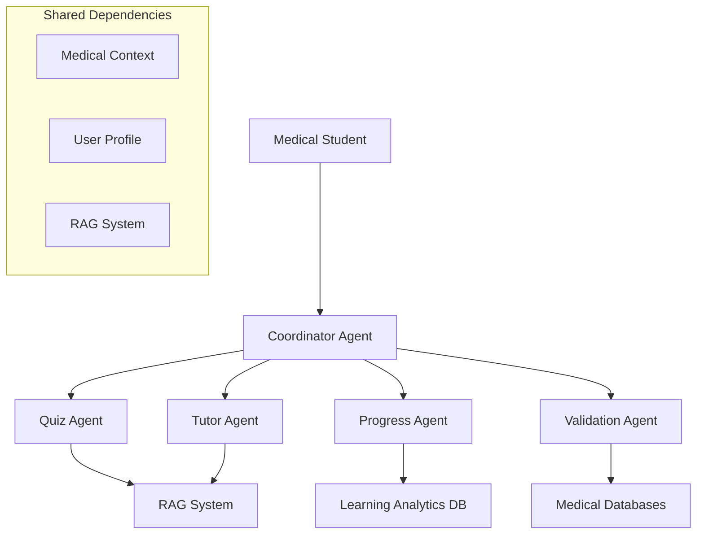

# PydanticAI Architecture Discussion & Implementation Strategy

**Date**: January 8, 2025  
**Decision**: Adopt PydanticAI framework for multi-agent medical education system  
**Status**: Implementation planning complete, ready for development

## 🎯 Strategic Decision Rationale

### Why PydanticAI Over Alternatives

**Evaluated Options**:
- **LangChain**: Too complex, heavyweight for our focused use case
- **Custom Agent Framework**: Reinventing the wheel, maintenance burden
- **Monolithic Expansion**: Limited scalability and agent specialization
- **PydanticAI**: ✅ **SELECTED** - Purpose-built for multi-agent systems

### PydanticAI Advantages for MedMind

1. **Agent-First Design**: Natural support for specialized learning agents
2. **Type Safety**: Pydantic models ensure validated educational content
3. **Dependency Injection**: Clean sharing of medical context and user profiles
4. **Tool Integration**: Seamless integration with existing RAG system
5. **Conversation Memory**: Multi-turn interactions for contextual learning
6. **Production Ready**: Usage limits, error handling, streaming support

## 🏗️ Multi-Agent Architecture Design

### Agent Hierarchy & Specialization



### Agent Responsibilities

**1. Coordinator Agent**
- **Role**: Main orchestrator and user interface
- **Responsibilities**: Route requests, manage conversation flow, coordinate responses
- **Input**: Natural language requests from students
- **Output**: Orchestrated learning experiences

**2. Quiz Agent**
- **Role**: Assessment and question generation specialist
- **Responsibilities**: Create adaptive quizzes, difficulty progression, immediate feedback
- **Input**: Topic, difficulty level, question count
- **Output**: Structured quiz questions with explanations

**3. Progress Agent**
- **Role**: Learning analytics and personalization specialist
- **Responsibilities**: Track mastery, spaced repetition scheduling, knowledge gap analysis
- **Input**: Performance data, learning sessions
- **Output**: Progress updates, review recommendations

**4. Tutor Agent**
- **Role**: Explanatory teaching specialist
- **Responsibilities**: Contextual explanations, concept clarification, guided learning
- **Input**: Questions, concepts, learning objectives
- **Output**: Educational explanations with source attribution

**5. Validation Agent**
- **Role**: Medical accuracy and fact-checking specialist
- **Responsibilities**: Cross-reference medical databases, expert review workflows
- **Input**: Medical claims, educational content
- **Output**: Accuracy assessments, fact-check results

## 🔧 Technical Implementation Strategy

### Core Dependencies Architecture

```python
# Shared context across all agents
@dataclass
class MedicalContext:
    user_id: str
    rag_system: RAGSystem  # Existing system as tool
    learning_profile: UserLearningProfile
    session_history: list[dict]
    preferences: UserPreferences

@dataclass
class UserLearningProfile:
    mastery_scores: dict[str, float]
    difficulty_preferences: dict[str, str]
    spaced_repetition_schedule: dict[str, datetime]
    knowledge_gaps: list[str]
```

### Agent Implementation Patterns

**Type-Safe Agent Outputs**:
```python
class QuizQuestion(BaseModel):
    question: str
    options: list[str]
    correct_answer: int
    explanation: str
    difficulty: Literal['beginner', 'intermediate', 'advanced']
    medical_tags: list[str]
    source_citations: list[str]

class ProgressUpdate(BaseModel):
    mastery_scores: dict[str, float]
    recommended_review: list[str]
    next_difficulty: str
    spaced_repetition_due: dict[str, datetime]
    achievements_unlocked: list[str]
```

**Agent Coordination Pattern**:
```python
coordinator = Agent(
    'gemini-2.0-flash-exp',
    deps_type=MedicalContext,
    output_type=LearningResponse,
    system_prompt="Route educational requests to specialized agents."
)

@coordinator.tool
async def generate_quiz(ctx: RunContext[MedicalContext], topic: str) -> QuizResponse:
    # Delegate to quiz agent with shared context
    result = await quiz_agent.run(
        f"Create adaptive quiz on {topic}",
        deps=ctx.deps,
        usage=ctx.usage
    )
    return result.output
```

### Migration Strategy from Monolithic System

**Phase 1: Foundation (Week 1)**
- Implement Coordinator Agent wrapping existing RAG functionality
- Establish dependency injection patterns
- Create basic agent testing framework

**Phase 2: Specialization (Week 2-3)**
- Implement Quiz Agent with question generation
- Add Progress Agent with simple analytics
- Create agent coordination workflows

**Phase 3: Enhancement (Week 4-5)**
- Add Tutor Agent for advanced explanations
- Implement Validation Agent for medical accuracy
- Add conversational memory and advanced features

## 🧪 Testing Strategy for Multi-Agent System

### Agent Testing Patterns

**Individual Agent Testing**:
```python
# Mock dependencies for isolated testing
@pytest.fixture
def mock_medical_context():
    return MedicalContext(
        user_id="test_student",
        rag_system=MockRAGSystem(),
        learning_profile=UserLearningProfile(...),
        session_history=[],
        preferences=UserPreferences(...)
    )

def test_quiz_agent_question_generation(mock_medical_context):
    result = quiz_agent.run_sync(
        "Generate 3 questions on neurophysiology",
        deps=mock_medical_context
    )
    assert len(result.output.questions) == 3
    assert all(q.difficulty in ['beginner', 'intermediate', 'advanced'] 
               for q in result.output.questions)
```

**Agent Coordination Testing**:
```python
def test_coordinator_routes_to_quiz_agent():
    result = coordinator.run_sync(
        "I want to practice neurophysiology with a quiz",
        deps=medical_context
    )
    # Verify coordinator delegated to quiz agent
    assert result.output.content_type == "quiz"
    assert len(result.output.quiz_questions) > 0
```

## 📊 Performance Considerations

### Token Usage Optimization
- **Agent Coordination**: Use cheaper models for routing decisions
- **Specialized Tasks**: Use appropriate model power for each agent
- **Context Management**: Implement token limits and context compression
- **Caching**: Cache agent responses for common educational patterns

### Scalability Patterns
- **Concurrent Agents**: Multiple students can use different agents simultaneously
- **Stateless Design**: Agents don't maintain internal state between requests
- **Database Separation**: User data isolated from medical content
- **Usage Monitoring**: Track token consumption per agent and user

## 🔄 Development Workflow

### Agent Development Cycle
1. **Design Agent Responsibility**: Define clear scope and outputs
2. **Create Pydantic Models**: Type-safe inputs and outputs
3. **Implement Agent Logic**: PydanticAI agent with tools
4. **Add Integration Tests**: Agent coordination testing
5. **Update Coordinator**: Route new capabilities
6. **Performance Validation**: Token usage and response time testing

### Code Organization
```
physiology_rag/
├── agents/
│   ├── __init__.py
│   ├── coordinator.py      # Main orchestrator
│   ├── quiz_agent.py      # Question generation specialist
│   ├── progress_agent.py  # Learning analytics specialist
│   ├── tutor_agent.py     # Explanation specialist
│   └── validation_agent.py # Medical accuracy specialist
├── dependencies/
│   ├── __init__.py
│   ├── medical_context.py # Shared agent context
│   ├── user_profiles.py   # Learning personalization
│   └── rag_integration.py # RAG system as agent tool
└── models/
    ├── __init__.py
    ├── learning_models.py # Educational Pydantic models
    ├── quiz_models.py     # Assessment structures
    └── progress_models.py # Analytics models
```

## 🎯 Success Metrics

### Technical Metrics
- **Response Time**: <2 seconds for single agent calls, <5 seconds for coordination
- **Token Efficiency**: <50% increase in token usage vs monolithic system
- **Type Safety**: 100% validated inputs/outputs across all agents
- **Test Coverage**: >90% for agent logic and coordination

### Educational Metrics
- **Learning Engagement**: Multi-turn conversations >3 exchanges
- **Adaptive Accuracy**: Quiz difficulty matches student performance
- **Progress Tracking**: Measurable learning progression over time
- **Medical Accuracy**: >95% fact-check validation for educational content

## 🚀 Implementation Readiness

### Prerequisites Completed
- ✅ PydanticAI framework analysis and understanding
- ✅ Multi-agent architecture design
- ✅ Migration strategy planning
- ✅ Testing approach defined
- ✅ Performance considerations documented

### Ready for Implementation
- **Coordinator Agent**: Foundation agent ready for development
- **Dependency Injection**: Context patterns designed
- **Type Models**: Pydantic structures planned
- **Testing Framework**: Agent testing patterns established

**Next Action**: Begin Coordinator Agent implementation as foundation for multi-agent learning system.

---

**Decision Confidence**: High - PydanticAI aligns perfectly with educational agent specialization needs  
**Implementation Risk**: Low - Incremental migration preserves existing functionality  
**Educational Impact**: High - Transform from Q&A tool to comprehensive tutoring platform