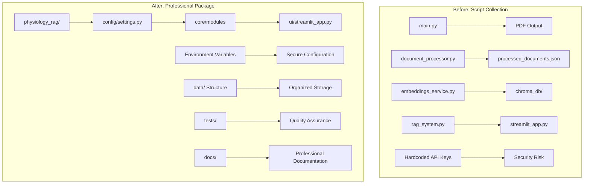
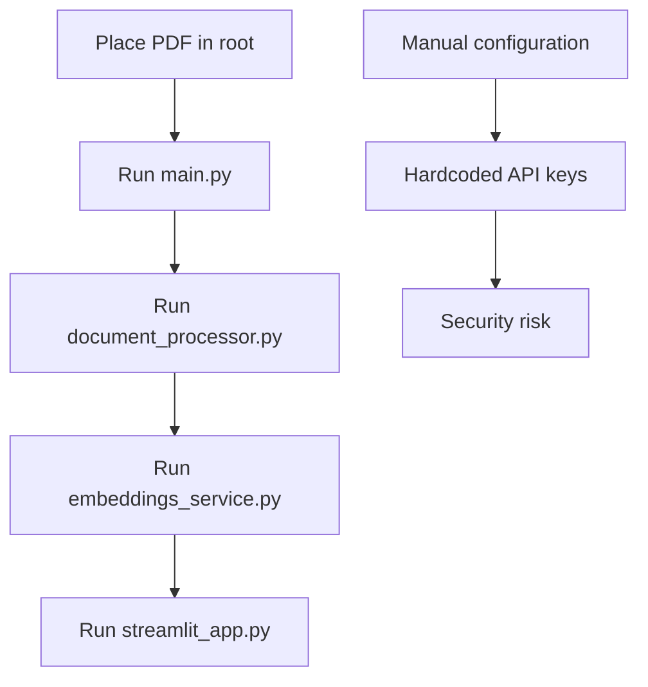
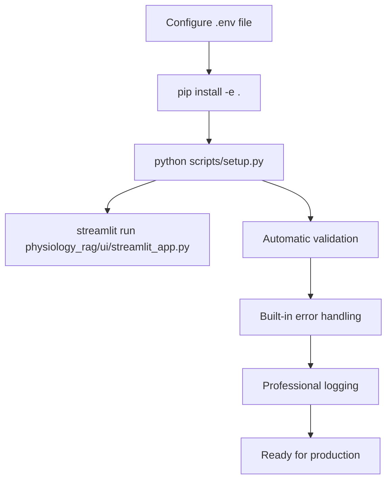
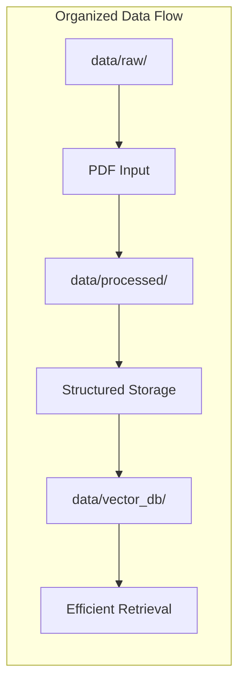

# Physiology RAG System - Setup Summary

## 🎯 Project Transformation Overview

This document summarizes the comprehensive restructuring of the Physiology RAG system from a prototype script collection to a professional, production-ready Python package following industry best practices.

## 📊 Before vs After Comparison

### **System Architecture Evolution**



### **File Structure Transformation**

| **Before (Prototype)** | **After (Production-Ready)** |
|------------------------|------------------------------|
| ❌ All files in root directory | ✅ Organized package structure |
| ❌ Hardcoded API keys in source | ✅ Environment-based configuration |
| ❌ No documentation | ✅ Comprehensive documentation |
| ❌ No testing framework | ✅ pytest with fixtures |
| ❌ Basic requirements.txt | ✅ Modern pyproject.toml packaging |
| ❌ No logging system | ✅ Structured logging throughout |
| ❌ Manual setup process | ✅ One-command setup script |

## 🏗️ New Package Architecture

```
physiology_rag/
├── 📦 PACKAGE STRUCTURE
│   ├── physiology_rag/           # Main package
│   │   ├── config/               # 🔧 Configuration Management
│   │   │   └── settings.py       # Environment-based settings
│   │   ├── core/                 # 🧠 Core Business Logic
│   │   │   ├── document_processor.py    # Smart chunking
│   │   │   ├── embeddings_service.py    # Vector operations
│   │   │   └── rag_system.py           # Complete RAG pipeline
│   │   ├── pdf_processing/       # 📄 PDF Conversion
│   │   ├── ui/                   # 💻 User Interfaces
│   │   │   └── streamlit_app.py  # Interactive chat
│   │   ├── agents/               # 🤖 Future AI Agents
│   │   └── utils/                # 🛠️ Utilities
│   │       └── logging.py        # Structured logging
│   │
├── 📁 DATA ORGANIZATION
│   ├── data/                     # Organized data storage
│   │   ├── raw/                  # Input PDFs
│   │   ├── processed/            # Processed documents
│   │   ├── vector_db/            # ChromaDB storage
│   │   └── uploads/              # User uploads
│   │
├── 🧪 QUALITY ASSURANCE
│   ├── tests/                    # Test suite
│   │   ├── conftest.py           # Test fixtures
│   │   └── test_*.py             # Unit tests
│   │
├── 📚 DOCUMENTATION
│   ├── README.md                 # Comprehensive guide
│   ├── LICENSE                   # MIT license
│   ├── .env.example              # Configuration template
│   └── docs/                     # Additional documentation
│
└── ⚙️ DEVELOPMENT TOOLS
    ├── pyproject.toml            # Modern packaging
    ├── requirements.txt          # Core dependencies
    ├── requirements-dev.txt      # Development dependencies
    └── scripts/setup.py          # One-command setup
```

## 🚀 Key Features Implemented

### 1. **Environment-Based Configuration**

**Why**: Security and flexibility - no more hardcoded API keys in source code.

**How to Use**:
```bash
# Copy template and configure
cp .env.example .env

# Edit with your API key
GEMINI_API_KEY=your-actual-key-here
```

**Benefits**:
- ✅ Secure API key management
- ✅ Environment-specific configurations
- ✅ Type-safe settings with Pydantic
- ✅ Easy deployment across environments

### 2. **Professional Package Structure**

**Why**: Maintainability, scalability, and team collaboration.

**How to Use**:
```python
# Import from organized modules
from physiology_rag.core.rag_system import RAGSystem
from physiology_rag.config.settings import get_settings

# Clean, predictable imports
rag = RAGSystem()
settings = get_settings()
```

**Benefits**:
- ✅ Clear separation of concerns
- ✅ Easy to find and modify code
- ✅ Ready for team development
- ✅ Extensible for new features

### 3. **One-Command Setup**

**Why**: Simplify complex multi-step processes into single command.

**How to Use**:
```bash
# Complete system setup
python scripts/setup.py

# Automatic:
# - Document processing
# - Vector database creation
# - System validation
# - Ready to use!
```

**Benefits**:
- ✅ Eliminates setup complexity
- ✅ Consistent environment setup
- ✅ Built-in validation
- ✅ Error handling and recovery

### 4. **Comprehensive Logging System**

**Why**: Debugging, monitoring, and understanding system behavior.

**How to Use**:
```python
from physiology_rag.utils.logging import get_logger

logger = get_logger("my_module")
logger.info("Processing started")
logger.error("Something went wrong")
```

**Benefits**:
- ✅ Structured, consistent logging
- ✅ Configurable log levels
- ✅ Easy debugging and monitoring
- ✅ Production-ready logging

### 5. **Modern Python Packaging**

**Why**: Professional distribution, dependency management, and installation.

**How to Use**:
```bash
# Install in development mode
pip install -e .

# Install with optional dependencies
pip install -e .[dev,docs]

# Use CLI commands
rag-process    # Process documents
rag-embed      # Create embeddings
rag-test       # Test system
```

**Benefits**:
- ✅ Professional installation process
- ✅ CLI command integration
- ✅ Proper dependency management
- ✅ Ready for PyPI distribution

### 6. **Testing Framework**

**Why**: Code quality, reliability, and regression prevention.

**How to Use**:
```bash
# Run all tests
pytest

# Run with coverage
pytest --cov=physiology_rag

# Run specific tests
pytest tests/test_rag_system.py
```

**Benefits**:
- ✅ Automated quality assurance
- ✅ Catch bugs early
- ✅ Safe refactoring
- ✅ Documentation through tests

## 📈 System Workflow Comparison

### **Before: Manual Multi-Step Process**



### **After: Streamlined Professional Workflow**



## 🎯 Usage Scenarios

### **For Developers**

```bash
# Get started quickly
git clone repo
cp .env.example .env      # Add your API key
pip install -e .[dev]     # Install with dev tools
python scripts/setup.py  # One-command setup
pytest                    # Run tests
```

### **For End Users**

```bash
# Simple installation
pip install physiology-rag
export GEMINI_API_KEY=your-key
rag-setup                          # Setup system
streamlit run --server.port 8501   # Launch UI
```

### **For Medical Students**

1. **Upload PDFs**: Place physiology documents in `data/raw/`
2. **Process**: Run setup to convert and index documents
3. **Ask Questions**: Use the chat interface for interactive learning
4. **Get Sources**: See exactly which documents inform each answer

## 🔧 Development Benefits

### **Code Quality Tools**

| Tool | Purpose | Usage |
|------|---------|-------|
| **Black** | Code formatting | `black physiology_rag/` |
| **isort** | Import sorting | `isort physiology_rag/` |
| **mypy** | Type checking | `mypy physiology_rag/` |
| **pytest** | Testing | `pytest --cov` |
| **pre-commit** | Git hooks | `pre-commit run --all-files` |

### **Configuration Management**

```python
# Type-safe configuration
class Settings(BaseSettings):
    gemini_api_key: str               # Required
    chunk_size: int = 1000           # Optional with default
    log_level: str = "INFO"          # Environment override
    
    class Config:
        env_file = ".env"            # Automatic .env loading
```

## 📊 Performance & Scalability Improvements

### **Data Organization**



### **Processing Pipeline**

| Stage | Before | After | Improvement |
|-------|--------|-------|-------------|
| **PDF Processing** | Manual file placement | Organized `data/raw/` | ✅ Clear input location |
| **Document Processing** | Root directory output | Structured `data/processed/` | ✅ Organized storage |
| **Vector Database** | `chroma_db/` in root | `data/vector_db/` | ✅ Clean separation |
| **Configuration** | Hardcoded values | Environment variables | ✅ Flexible configuration |

## 🚀 Ready for Production

### **Deployment Features**

- **Docker Ready**: Clean package structure for containerization
- **CI/CD Ready**: Testing framework and quality tools
- **Environment Flexibility**: Configuration for dev/staging/prod
- **Monitoring**: Comprehensive logging system
- **Documentation**: Professional README and guides

### **Extensibility**

The new structure is designed for easy extension:

```python
# Add new agents easily
class QuizAgent:
    def __init__(self, rag_system):
        self.rag = rag_system
    
    def generate_quiz(self, topic):
        # Use existing RAG pipeline
        pass

class FlashcardAgent:
    def __init__(self, rag_system):
        self.rag = rag_system
    
    def create_flashcards(self, topic):
        # Leverage document processing
        pass
```

## 📋 Migration Checklist

- ✅ **Project Structure**: Organized package layout
- ✅ **Configuration**: Environment-based settings
- ✅ **Documentation**: Comprehensive README and guides
- ✅ **Testing**: pytest framework with fixtures
- ✅ **Logging**: Structured logging system
- ✅ **Packaging**: Modern pyproject.toml setup
- ✅ **Security**: No hardcoded credentials
- ✅ **Data Organization**: Clean data directory structure
- ✅ **CLI Tools**: Professional command-line interface
- ✅ **Quality Tools**: Code formatting and type checking

## 🎉 Summary

**From Prototype to Production**: We transformed a collection of scripts into a professional Python package that's ready for team development, production deployment, and feature extension.

**Key Achievements**:
- 🔐 **Security**: Environment-based configuration
- 🏗️ **Structure**: Professional package organization
- 📚 **Documentation**: Comprehensive guides and API docs
- 🧪 **Quality**: Testing framework and code quality tools
- 🚀 **Usability**: One-command setup and clear workflows
- 🔧 **Maintainability**: Logging, error handling, and clean code
- 📈 **Scalability**: Ready for team development and feature extension

The system is now ready for GitHub publication, team collaboration, and production deployment while maintaining all existing functionality with improved reliability and usability.

## 🧹 Root Directory Cleanup (Latest Update)

**Date**: Final cleanup phase to achieve professional project organization

### **Challenge**: Cluttered Root Directory
The project root directory contained multiple Python script files that made the project appear disorganized and confused the proper package structure.

### **Files Reorganized**:

#### **🗑️ Removed Outdated Duplicates**
- ❌ `document_processor.py` (root) → Already exists in `physiology_rag/core/`
- ❌ `embeddings_service.py` (root) → Already exists in `physiology_rag/core/`  
- ❌ `rag_system.py` (root) → Already exists in `physiology_rag/core/`
- ❌ `streamlit_app.py` (root) → Already exists in `physiology_rag/ui/`

*These root files were outdated versions without proper logging, configuration, or error handling.*

#### **📂 Moved to `examples/` Directory**
- ✅ `simple_streamlit.py` → `examples/simple_streamlit.py` (debugging UI)
- ✅ `simple_rag.py` → `examples/simple_rag.py` (debugging RAG)
- ✅ `main.py` → `examples/main.py` (PDF conversion script)
- ✅ `setup_rag.py` → `examples/setup_rag.py` (old Vertex AI setup)
- ✅ `batch_test.py` → `examples/batch_test.py` (PDF batch processing)

#### **🧪 Moved to `tests/` Directory**
- ✅ `test_auth.py` → `tests/test_auth.py` (Google Cloud auth test)
- ✅ `test_gemini_embeddings.py` → `tests/test_gemini_embeddings.py` (Gemini API test)

### **🔧 Technical Improvements**

#### **Import Statement Updates**
```python
# Before (broken imports)
from embeddings_service import EmbeddingsService
from rag_system import RAGSystem

# After (proper package imports)
from physiology_rag.core.embeddings_service import EmbeddingsService
from physiology_rag.core.rag_system import RAGSystem
```

#### **Security Enhancements**
- 🔐 **Removed Hardcoded API Keys**: All example and test files now use environment variables
- 🛡️ **Added Security Notes**: Clear documentation that example files are for debugging only
- ⚠️ **Environment Variable Validation**: Proper error handling when API keys are missing

#### **Documentation Updates**
- 📚 **CLAUDE.md**: Updated file paths and added examples directory reference
- 📖 **README.md**: Verified and maintained accurate usage instructions
- 📝 **Added Notes**: Clear distinction between production and example code

### **📊 Before vs After Structure**

```
# BEFORE: Cluttered Root
├── document_processor.py          ❌ DUPLICATE
├── embeddings_service.py          ❌ DUPLICATE
├── rag_system.py                  ❌ DUPLICATE
├── streamlit_app.py               ❌ DUPLICATE
├── simple_streamlit.py            ❌ MISPLACED
├── simple_rag.py                  ❌ MISPLACED
├── main.py                        ❌ MISPLACED
├── setup_rag.py                   ❌ MISPLACED
├── batch_test.py                  ❌ MISPLACED
├── test_auth.py                   ❌ MISPLACED
├── test_gemini_embeddings.py      ❌ MISPLACED
└── physiology_rag/               ✅ PACKAGE

# AFTER: Clean Professional Structure
├── physiology_rag/               ✅ MAIN PACKAGE
├── examples/                     ✅ DEMO SCRIPTS
│   ├── simple_streamlit.py       
│   ├── simple_rag.py
│   ├── main.py
│   ├── setup_rag.py
│   └── batch_test.py
├── tests/                        ✅ TEST SUITE
│   ├── test_auth.py
│   └── test_gemini_embeddings.py
├── README.md                     ✅ DOCUMENTATION
├── CLAUDE.md                     ✅ DEVELOPMENT GUIDE
└── pyproject.toml                ✅ PACKAGING
```

### **🎯 Benefits Achieved**

1. **📁 Professional Organization**
   - Clean root directory with only essential configuration files
   - Clear separation between production code and examples
   - Proper test directory structure

2. **🔒 Enhanced Security**
   - No hardcoded API keys in any files
   - Environment-based configuration throughout
   - Clear security best practices demonstrated

3. **🧭 Improved Navigation**
   - Developers immediately understand project structure
   - Examples are clearly marked as debugging tools
   - Production code is easily identifiable

4. **🔧 Better Maintainability**
   - No confusion between old and new file versions
   - Proper import statements throughout
   - Documentation accurately reflects file locations

5. **📦 GitHub Ready**
   - Professional appearance for open source publication
   - Clear project structure for contributors
   - Production-ready organization

### **🚀 Impact on Development Workflow**

```bash
# OLD: Confusing file locations
python streamlit_app.py              # ❌ Which version?
python simple_rag.py                # ❌ Mixed with production code

# NEW: Clear, organized structure  
streamlit run physiology_rag/ui/streamlit_app.py    # ✅ Production UI
python examples/simple_rag.py                       # ✅ Clear it's an example
pytest tests/                                       # ✅ Run all tests
```

This cleanup transforms the project from a script collection into a professionally organized Python package that follows industry best practices and is ready for team collaboration and open source publication.